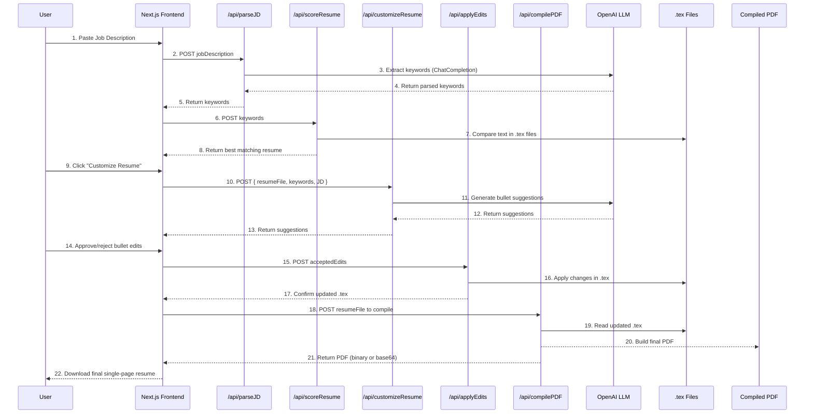
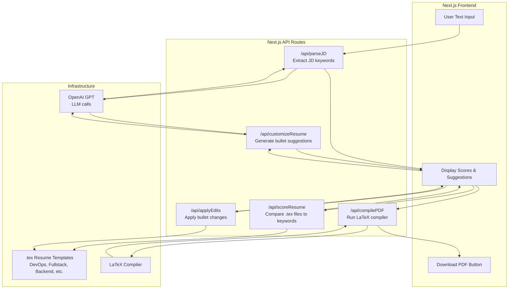

## 2. System Requirements Document

### High-Level System Architecture (Flowchart)
```mermaid
flowchart LR
    A(User) --> B(Next.js Frontend): "1. Paste JD"
    B --> C(Next.js API Routes): "2. Send to /api/parseJD"
    C --> D(OpenAI LLM): "3. Extract keywords w/ OpenAI"
    D --> C
    C --> B: "4. Return keywords"
    
    B --> C2(Next.js API Routes): "5. Send keywords to /api/scoreResume"
    C2 --> E[.tex Resume Files]: "6. Compare each .tex"
    E --> C2
    C2 --> B: "7. Return best match"
    
    B --> F(Next.js API Routes /api/customizeResume): "8. User opts to customize resume"
    F --> D2(OpenAI LLM): "9. Generate bullet suggestions w/ OpenAI"
    D2 --> F
    F --> B: "10. Return suggestions"

    B --> G(Apply Edits to .tex): "11. Accept changes -> /api/applyEdits"
    G --> E
    E --> G
    G --> B: "12. Return updated .tex"

    B --> H(LaTeX Compiler): "13. /api/compilePDF"
    H --> I[Final PDF]: "14. Produce PDF"
    I --> A: "15. Download"
```
**Explanation**:
- User pastes the job description (JD) into the Next.js Frontend.
- The frontend calls the parseJD API route, which uses OpenAI to extract keywords/skills.
- The scoreResume API checks those keywords against local .tex files to pick the best fit.
- The user optionally calls the customizeResume API, which again leverages OpenAI to generate bullet-point suggestions.
- The user approves or rejects changes, which are then applied to the relevant .tex file.
- Finally, the system compiles the updated .tex into a PDF, which the user downloads.

### Main User Flow (Sequence Diagram)

**Explanation**:
- Shows step-by-step interactions from the moment the user pastes a JD, through OpenAI calls, to final PDF delivery.
- Highlights how each Next.js API route plays a distinct role (parse, score, customize, apply edits, compile).

### Component Breakdown (Flowchart with Emphasis on Modules)

**Explanation**:
- The Frontend has three major UI pieces: text input for the JD, an area to display results (scores, suggestions), and a final PDF download button.
- API Routes handle each discrete piece of logic: parse, score, customize, edit, compile.
- Infrastructure includes OpenAI for LLM tasks, your .tex files, and a LaTeX compiler to produce the PDF.


### 2.1 Functional Requirements

#### 2.1.1 Job Description Input & Parsing
- **FR-1**: The system shall provide a text input box for users to paste job descriptions.
- **FR-2**: The system shall use an NLP model (OpenAI GPT, Claude, or a custom NLP) to extract keywords, required technologies, and role requirements from the job description.
- **FR-3**: The system shall store the parsed keywords and their importance/priority for further matching.

#### 2.1.2 Resume Matching & Selection
- **FR-4**: The system shall maintain a store of five distinct .tex resume templates.
- **FR-5**: The system shall compare the parsed keywords with each resume’s text content to generate a “fit score.”
- **FR-6**: The system shall automatically select the resume with the highest fit score.
- **FR-7**: The system shall present the chosen resume and the fit score to the user, e.g., “Resume X is selected with a 15/20 keyword match.”

#### 2.1.3 Customizing the Selected Resume
- **FR-8**: The system shall provide an option for the user to approve or decline further optimizations.
- **FR-9**: If optimization is approved, the system shall generate new or updated bullet points for the selected resume using LLM capabilities.
- **FR-10**: The system shall replace or remove existing bullet points to maintain a single-page format, ensuring the final text fits.
- **FR-11**: The system shall display each suggested change (new bullet point, replaced bullet point, etc.) and allow the user to accept or reject it individually.
- **FR-12**: The system shall finalize the resume once all user approvals or rejections are captured.

#### 2.1.4 LaTeX Editing and PDF Generation
- **FR-13**: The system shall programmatically edit the .tex file corresponding to the selected resume based on the user-approved changes.
- **FR-14**: The system shall compile the updated .tex file into a single-page PDF.
- **FR-15**: The system shall provide the final PDF as a downloadable file or link to the user.

#### 2.1.5 User Interaction and Flow
- **FR-16**: The system shall provide a simple UI or dashboard where the user can:
    - Input/paste the job description.
    - View the selected resume’s match score.
    - Approve or decline optimization.
    - Review/approve individual bullet changes.
- **FR-17**: The system shall show a summary of changes before finalizing the resume.
- **FR-18**: The system shall store logs of the changes (optional) for user reference or debugging.

### 2.2 Non-Functional Requirements

#### 2.2.1 Performance
- **NFR-1**: The system should parse the job description and suggest a matched resume within ~30 seconds to 1 minute.
- **NFR-2**: PDF generation should complete within a few seconds after the final .tex file is ready.

#### 2.2.2 Usability
- **NFR-3**: The user interface should be intuitive, allowing a first-time user to navigate from input to final PDF with minimal confusion.
- **NFR-4**: The system should provide clear messaging for each step (e.g., “Scanning job description…”, “Generating bullet points…”, etc.).

#### 2.2.3 Reliability and Availability
- **NFR-5**: The system should maintain stability with typical usage patterns (e.g., multiple job descriptions per day).
- **NFR-6**: For a cloud deployment, the system should aim for at least 99% uptime over a month (if offered as a service).

#### 2.2.4 Scalability
- **NFR-7**: The system architecture should allow easy integration of additional resume templates if needed.
- **NFR-8**: The system should handle multiple users concurrently if expanded for broader use.

#### 2.2.5 Security
- **NFR-9**: The system should not expose personal details to unauthorized parties.
- **NFR-10**: The system should store user data (if any) in a secure manner.

#### 2.2.6 Maintainability
- **NFR-11**: Codebase should be well-documented and modular for easy updates (e.g., changing LLM endpoints, adding templates, updating bullet-point generation logic).
- **NFR-12**: Clear instructions on how to add or modify .tex resume templates.

### 2.3 System Architecture Overview
Below is a high-level architecture outline:

#### Frontend (Next.js)
- Job Description Input: Text area for pasting the JD.
- Recommendation Display: Shows matched resume and score.
- Interactive Editing: UI for approving/declining bullet point suggestions.

#### Backend (Python or Node.js)
- NLP / LLM Module: Parses JD, identifies keywords, calls GPT/Claude for bullet generation.
- Matching Engine: Compares JD keywords with each resume, calculates scores.
- Resume Customization Module: Edits .tex content, ensures single-page format remains intact.
- LaTeX Compilation: Either a local LaTeX distribution or a cloud-based compilation service to output PDF.

#### Data Storage
- Resumes: Five .tex templates stored in a repository or cloud storage.
- Logs and User Data: Minimal logging for changes, scores, and accepted bullet points.

#### LLM Integration
- The system integrates with OpenAI’s GPT or Anthropic’s Claude for bullet-point generation and advanced context matching.
- Must handle authentication and usage limits.

### 2.4 Constraints and Considerations
- **Single-Page Formatting**: The system must carefully manage whitespace, line breaks, and bullet lengths.
- **Cost of LLM**: Each call to GPT/Claude incurs a cost; design to minimize extraneous calls.
- **Legal and Ethical**: Potential mismatch between suggested bullet points and actual user experience must be clarified (disclaimer for user to confirm accuracy).

### 2.5 Acceptance Criteria
- **AC-1**: A user can paste a JD, and the system presents the top-matched resume within a minute.
- **AC-2**: The user can optionally accept or reject bullet-point optimizations, and the final PDF remains a single page.
- **AC-3**: The final PDF is successfully generated and contains the updated bullet points.
- **AC-4**: The user sees the match score for each resume, or at least for the top choice.
- **AC-5**: The system does not crash or exceed user-defined cost limits for LLM usage under normal operation.
